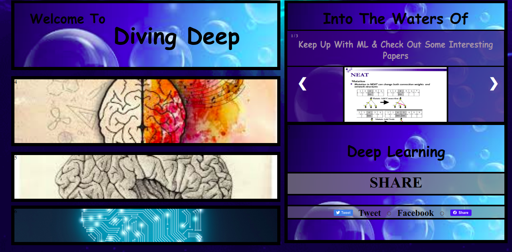
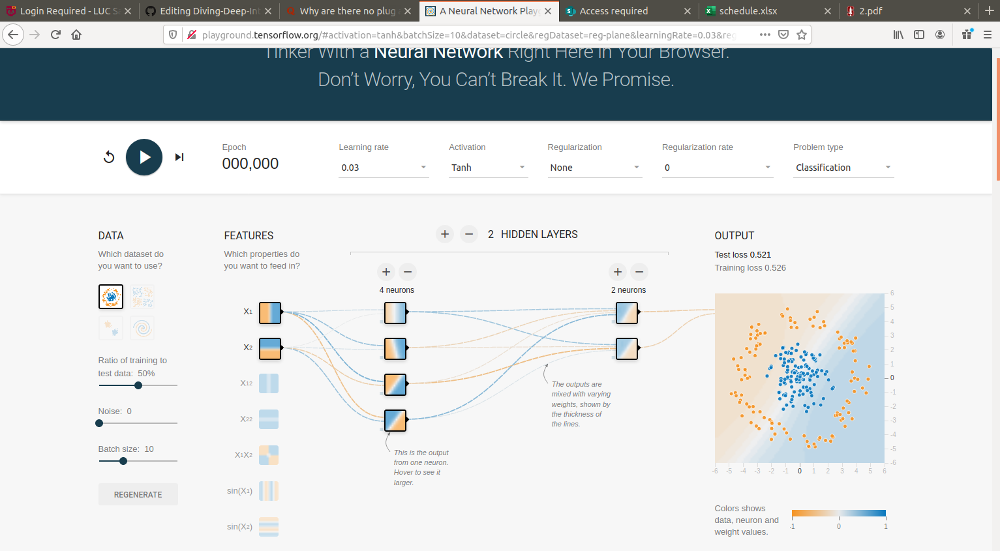
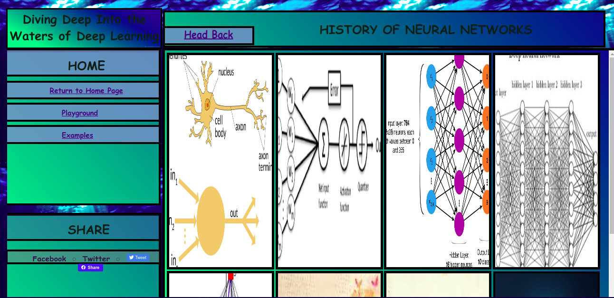
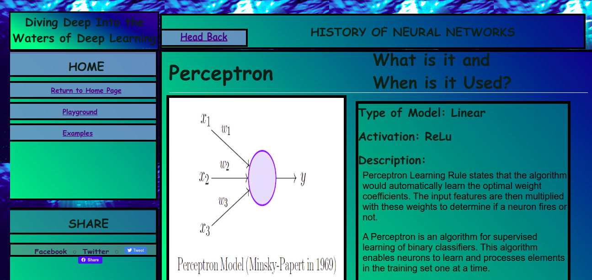

# Diving-Deep-Into-The-Waters-of-Deep-Learning

Artificial Neural Network (ANN) Design &amp; Architecture for simplistic understanding and modeling

**Abstract**

---

As Machine Learning (ML) becomes increasingly more popular around the field of Computer Science, there are simply not enough people who are willing or even have the slightest idea of what ML is all about. 

Imagine a domain where anyone of any age can easily enter this site and be able to understand how Artificial Neural Networks (ANN) work without relying on complex formulas. However, The concept and diagram of an NN are simple to interpret. Diving Deep into The Waters of Deep Learning is an application that relies on a visual representation of how data is processed through a Neural Network (NN).

Using a simple user-interface, the user (with no knowledge of Computer Science) would be able to design their own NN and feed their model input data which would then be able to observe exactly how the data was then interpreted by a computer, visually. As a result, a person at the age of 12 (for example) who does not know computers whatsoever would be able to create their own ANN that could solve a multitude of problems without having too many complications. 

My goal is to express this field to a variety of people since this is a hot topic in Computer Science today. Excitement is what gets people motivated to learn more in-depth - this web application would be a starting point for that excitement. 

---

**Motivation**

---
The motivation for Diving Deeps layout design comes from the existing application that is named
Neural  Network  Playground  for  Tensorflow.   From  looking  at  figure  1,  this  existing  application
allows  the  manipulation  of  the  NN  attributes  and  the  augmentation  of  its  topology  to  design
further complex models.  By playing around with its values and tuning, when the user hits play
there is a visual graph on how the current set model solves its dataset by separating data points
by individual classes. 

This webpage is meant to provide interest and to get users excited about a subject they felt may be impossible or too complicated to understand. By using CSS grids to outline the homepage made things simpler for the user to have easy navigation and have better design patterns and format viewpoints.

For the course of this web application, CSS grids were the main use to outline the containers and set the initial graphics for the user.  As we proceed forward to the playground in figure 3, we can see the resemblances and design motivation
that was given from the original neural network playground to Diving Deeps web page.

Figure 3:  ”Diving Deep”’s main playground.  This page consists of the users ability to create their
own Artificial Neural Network
---

This  playground  page  gives  the  user  the  practice  of  trial-and-error.  

One  of  the  most  time-consuming parts for building a Machine Learning model is being able to select the right learning
rate, types of layers, and the number of units per layer.  

Each of these attributes gives different results  each  time  -  it  is  up  to  the  user/programmer  to  find  that  perfect  balance  of  values  and layers that predicts the correct output 90 percent of the time. 

---

**Model Design and JS Libraries**

---
For graph visualization, the library d3.js was used to build
its nodes and connections between each layer.  Each NN model was built by formatting a JSON
object.  

Each JSON object contained nodes elements (e.g.  json=node:  []) that indicated how many
nodes  are  added  to  which  layer.   

These  considerations  are  all  extracted  from  the  user’s  control
panel  that  is  provided  on  the  current  playground  page.   Attributes  to  manipulate  the  current
model include the number of inputs, outputs, layers, units per layer, iterations, learning rate, and
activation functions.  

These values are then extracted and initialized to a machine learning library
named  brain.js.   This  library  provides  the  programmer  easy  access  to  building  a  simple  neural
network with n number of hidden layers which makes access to its attributes simple for the user
to build and train on.

---

---
**User Goals, Layout Design, and Possible datasets**
---

The dataset that was used to train its model on was an XOR .txt file which takes two inputs [1,
0] and outputs two classes that are correlated to the original XOR function.  

For example, based on the XOR function, inputs of 1 and 0 will output class 1 and inputs 1, 1 or 0, 0 will output 0.
This is a simple dataset to interpret and train on and provides building such a model to be simple,
fast, and easy to pick up and learn upon.

---

Lastly, the user has the option to read up on the history of artificial neural networks, as shown below:

Figure:  ”Diving Deep”’s History.  This page consists of the several subjects on the different types
of Neural Networks and how they are used.  This allows the user’s ability to have a starting point
when using the playground

Using CSS grids this current webpage displays multiple categories of different types of neural
networks such as Perceptrons,  Adaline,  Multi-layer perceptrons,  etc.  

The color scheme for each container  was  intended  to  match  the  moving  ocean  background.   When  the  user  clicks  one  of the  categories  as  shown  below,  the  new  page  presents  the  user  an  image  of  the  selected
category followed by a brief description of the category itself.  

This provides the user with a basic understanding of the fundamentals of neural networks and gives a basic idea of what kind of model would work best for the chosen dataset such as the XOR dataset.

”Diving Deep”’s History subsection (Perceptron).  This page provides the user details on
the chosen subject.  This example shows the Perceptron and its following description

---

**Restrictions, Limitations, Contraints**

---

As flexible this application may be, there have been a few restrictions that were given throughout
the making of this website. Since this application deals with deep neural networks, this also involves
working with larger and more complex datasets such as image datasets.  

The XOR dataset provides the user the simplicity to solve simple toy datasets however real datasets (image classification) are much harder to train.  

That being said, the amount of computing power needed to develop a web application for any user seemed a bit unrealistic considering not all users would have a powerful computing system that allows sufficient training.  This caused the restriction of having the user choose what dataset they would like to solve to be limited to only the XOR dataset.  

Having to choose which dataset to use was an important feature for this application because it would have
potentially given the users a much better example and amazement on how computers can learn
from images.  

Being able to only restrict themselves with 1s and 0s makes it confusing for the user
to understand how computations are done.  Without having any online GPU cloud to host the web
application caused some limitations that were expected since the beginning of the website.

---

**Last Remarks**

---
Diving  Deep  Into  The  Waters  of  Deep  Learning  is  a  web  application  that  allows  users  to  get
started on the basic knowledge of Machine Learning.  

The goal of this application was to expose users to complex ideas to a much more simplistic visualization and flexible navigation throughout the webpage.  

For future progress of this application, it may be a good idea to apply Flexbox style implementations as well as an online GPU cloud and an option for the user to select the dataset they choose to solve.  

It would also be interesting to see this application to have separate profiles for individual users which would then allow the user to create and train their best models and use them as references or even share with other potential users who are also solving the same dataset
