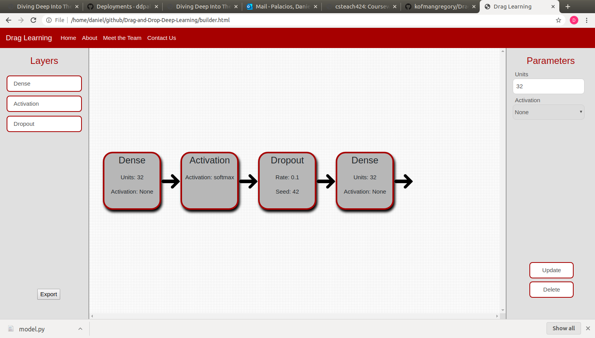
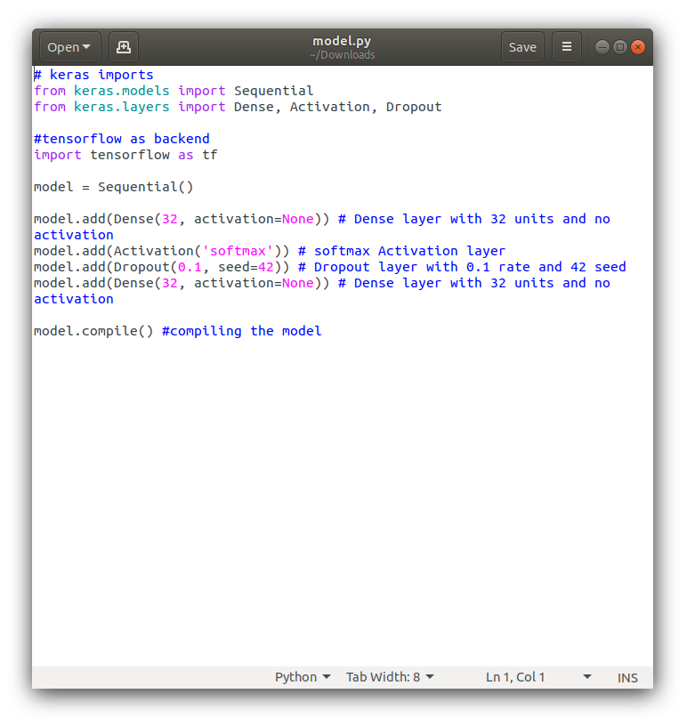

# Diving-Deep-Into-The-Waters-of-Deep-Learning

**Open in CHROME**:

  URL: https://ddpalacios.github.io/Diving-Deep-Into-The-Waters-of-Deep-Learning/

Artificial Neural Network (ANN) Design &amp; Architecture for simplistic understanding and modeling

**Abstract**

---

As the field of Machine Learning (ML) becomes increasingly more popular around the field of Computer Science, there are simply not enough people who are willing or even have the slightest idea of what ML is all about.

Imagine a domain where anyone of any age can easily enter this site and be able to understand how Artificial Neural Networks (ANN) work without involving any of the math and strictly relying on a visual representation on how data is processed through a Neural Network (NN).

The concept and diagram of an NN are simple to interpret. Using a simple UI, The user (with no knowledge of Computer Science) would be able to design their own NN (Imagine a drag n drop feature) and feed the algorithm some input data and be able to observe exactly how an image (for example) is then interpreted by a computer, visually.

As a result, a person at the age of 12 who has no knowledge about computers whatsoever would be able to create their own ANN that could solve a multitude of problems without having to know any of the math (if they wish)

My goal is to express this field to a variety of people since this is a hot topic in Computer Science today. Excitement is what gets people motivated to learn more in-depth - this project would be a starting point for that excitement.

---

**Motivation**

---
Building Artificial Neural Networks can become overwhelming and a user-interface can fix this issue. 

There are plenty of applications that allow you to visualize Neural Networks, however, most of these applications are still too complex and non-attractive or flexiable. 

We want this appliction to be as flexiable and as simple it can be for the user experience. 

**Drag n Drop**

Here is a good example of previous repository from ==> https://github.com/kofmangregory/Drag-and-Drop-Deep-Learning.git

In these images, we see that the UI has block features that represent individual features for a given layer and from here we can then export this model and the application will save a .py file of a KERAS implemented model of your design. 

**Frontend:**

**Output Python file:**

We want to be able to make this a bit more flexiable... This application does not give the user a simple drag n drop as it still faces certain limitations when wanting to build bigger or more complex models, we need to be able to use those features when needed. 

**Things to take note:**

- Drag n Drop is a good implementation to use. It creates entertainment and flexibility for the user.

- We also need to give our application the needed features in order to generate complex models

- Lastly, we need to render our model to visualize and train

For visualization, there exists a neural network playground for Tensorflow that allows these extra features to design further complex models in comparison to our first repository. 

**Output Python file:**

This is a great application for designing complex models however, this does not provide drang n drop implementations. We want to be able to combine a simple drag n drop UI as well as have complexity in our models. 

---
