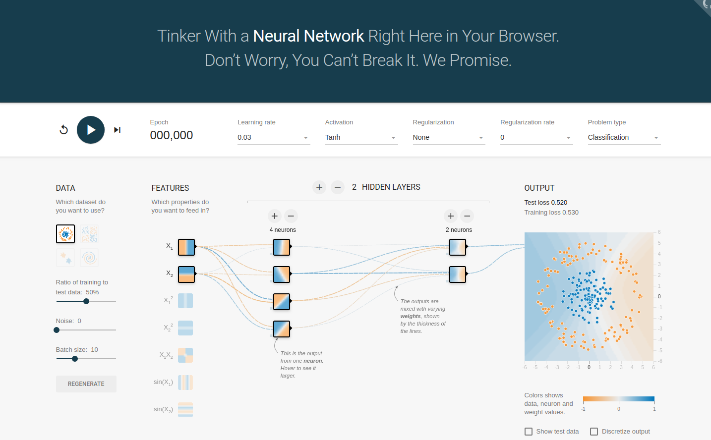
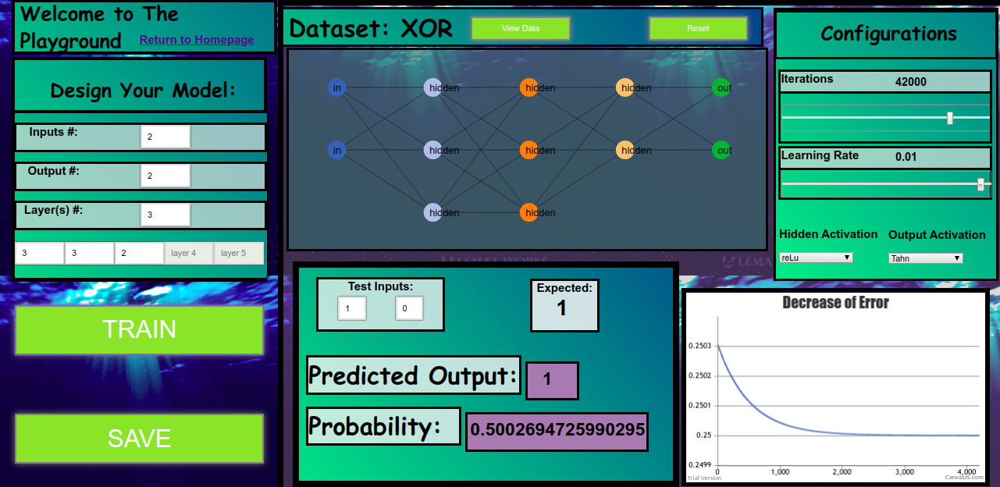

# Diving-Deep-Into-The-Waters-of-Deep-Learning

**Open in CHROME**:

  URL: https://ddpalacios.github.io/Diving-Deep-Into-The-Waters-of-Deep-Learning/

Artificial Neural Network (ANN) Design &amp; Architecture for simplistic understanding and modeling

**Abstract**

---

As Machine Learning (ML) becomes increasingly more popular around the field of Computer Science, there are simply not enough people who are willing or even have the slightest idea of what ML is all about. 

Imagine a domain where anyone of any age can easily enter this site and be able to understand how Artificial Neural Networks (ANN) work without relying on complex formulas. However, The concept and diagram of an NN are simple to interpret. Diving Deep into The Waters of Deep Learning is an application that relies on a visual representation of how data is processed through a Neural Network (NN).

Using a simple user-interface, the user (with no knowledge of Computer Science) would be able to design their own NN and feed their model input data which would then be able to observe exactly how the data was then interpreted by a computer, visually. As a result, a person at the age of 12 (for example) who does not know computers whatsoever would be able to create their own ANN that could solve a multitude of problems without having too many complications. 

My goal is to express this field to a variety of people since this is a hot topic in Computer Science today. Excitement is what gets people motivated to learn more in-depth - this web application would be a starting point for that excitement. 

---

**Motivation**

---
The motivation for Diving Deeps layout design comes from the existing application that is named
Neural  Network  Playground  for  Tensorflow.   From  looking  at  figure  1,  this  existing  application
allows  the  manipulation  of  the  NN  attributes  and  the  augmentation  of  its  topology  to  design
further complex models.  By playing around with its values and tuning, when the user hits play
there is a visual graph on how the current set model solves its dataset by separating data points
by individual classes. 

This webpage is meant to provide interest and to get users excited about a subject they felt may be impossible or too complicated to understand. By using CSS grids to outline the homepage made things simpler for the user to have easy navigation and have better design patterns and format viewpoints.

For the course of this web application, CSS grids were the main use to outline the containers and set the initial graphics for the user.  As we proceed forward to the playground in figure 3, we can see the resemblances and design motivation
that was given from the original neural network playground to Diving Deeps web page.

Figure 3:  ”Diving Deep”’s main playground.  This page consists of the users ability to create their
own Artificial Neural Network

---
